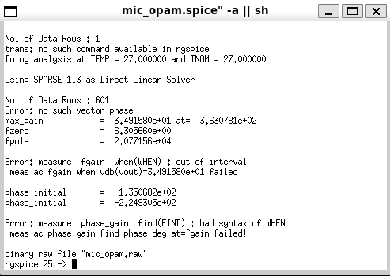

# 🎤 Analog IC Design 

This repository documents various aspects of analog integrated circuit (IC) design with examples, circuit images, simulations, and system-level analysis. It is structured for quick understanding and reference for students and enthusiasts in electronics and communication.

---

## 📑 Table of Contents

1. [USB Microphone System Analysis](#1-usb-microphone-system-analysis)
2. [High-Pass Filter Circuit](#2-high-pass-filter-circuit)  
3. [Biasing and Operating Point](#3-biasing-and-operating-point)  
4. [Small Signal Analysis](#4-small-signal-analysis)  
5. [Analog Building Blocks](#5-analog-building-blocks)  
6. [Tools and Simulation](#6-tools-and-simulation)  
7. [Challenges in Analog Design](#7-challenges-in-analog-design)  
8. [Future Trends in Analog ICs](#8-future-trends-in-analog-ics)  

---

## 1. USB Microphone System Analysis

This section explains the analog front-end of a USB microphone setup and its role in signal conditioning and conversion.

**System Overview**:

- **MEMS Microphone (SPH8878LR5H-1)**: Captures sound and outputs an analog voltage signal.
- **Amplification & Filtering**: The analog signal passes through a coupling capacitor and resistor, then enters an op-amp (OPA344) for amplification and noise filtering.
- **Analog to Digital Conversion (ADC)**: The conditioned analog signal is fed into an Arduino’s 10-bit ADC.
- **Digital Processing and USB Output**: The microcontroller processes the data and outputs it as USB-MIDI to a host device.

> 🎧 This design enables real-time conversion of sound into USB-MIDI digital data using analog IC techniques.

---
### 🎛️ Thevenin Equivalent Model of the Microphone

To understand the microphone as a signal source, it can be modeled with its **Thevenin equivalent**:

This model helps in:
- Analyzing signal strength and loading
- Impedance matching for the amplifier input
- Ensuring minimal signal loss at the interface

> 📷 This schematic shows the practical implementation of the Thevenin model using Xschem.
> ---

### 📈 Output Response of the Microphone Circuit

The simulation below shows the voltage output (`vout`) across the load, after signal amplification and filtering.

> 🧪 This waveform helps verify if the designed circuit properly amplifies the mic signal within expected voltage ranges.
> #### 📈 Frequency Response

The frequency response reveals the bandwidth and filtering effects of the analog stage.

" 
#### 🔁 Simulink Output

The Simulink simulation confirms system-level behavior and time-domain signal dynamics.

[Click here to view the Xschem code](https://github.com/Rani340/ANALOG-IC-ASSIGN-1/blob/main/xschem/mictest)

---
### 🔧 Op-Amp Modeling as a Single Pole System

To better analyze the frequency response of the analog front-end, the operational amplifier is modeled using a **single-pole transfer function**. This provides insight into the bandwidth limitations and phase behavior of the amplifier.

#### 🔁 Simulink Output

The Simulink simulation confirms system-level behavior and time-domain signal dynamics.

## 2. High-Pass Filter Circuit

This section explains the working and transfer function of a high-pass filter using an op-amp.

**Circuit Overview:**

- **Input Capacitor \( C_i = 4.7 \mu F \)**: Blocks DC and allows AC signals to pass.
- **Resistors \( R_i = R_f = 5k\Omega \)**: Define gain and time constant of the filter.
- **Op-Amp**: Configured in non-inverting mode to amplify the filtered signal.

**S-Domain Transfer Function:**

H(s) = (Rf * s * Ci) / (1 + s * Ri * Ci)

- At low frequencies (s → 0), H(s) → 0 → High attenuation of low-frequency signals.
- At high frequencies (s → ∞), H(s) → Rf / Ri = 1 → Passes high frequencies with gain 1.

---

### 🔻 Cutoff Frequency (fc):

fc = 1 / (2πRiCi)

For Ri = 5kΩ, Ci = 4.7μF:

fc ≈ 6.77 Hz

### 1. Op-Amp Schematic Diagram

*Detailed internal schematic of the operational amplifier:*

---

### 2. Op-Amp Symbolic Diagram

*Standard symbolic representation of an operational amplifier:*

---

### 3. High-Pass Filter Circuit Using the Op-Amp

*High-pass filter circuit built using the op-amp symbol shown above:*

